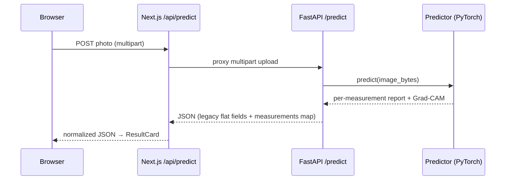
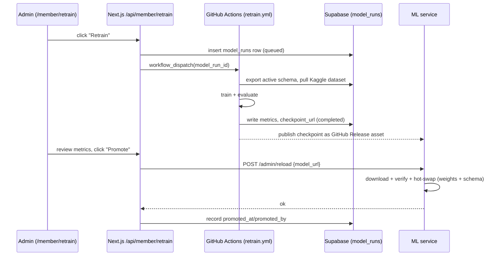
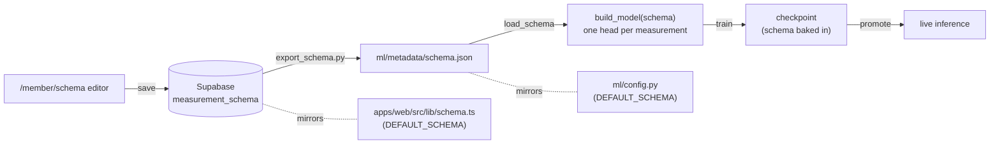

# Architecture

Mantis Vision is a monorepo with three cooperating parts and two external
services. This document explains how they fit together, how a request flows
through the system, and the schema-driven design that ties the web app and the
model together.

## System overview

```mermaid
flowchart TB
    subgraph Browser["Browser / PWA"]
        UI["Analyzer + /member admin dashboard"]
    end

    subgraph Web["apps/web (Next.js on Vercel)"]
        Routes["API routes\n/api/predict\n/api/member/*"]
    end

    subgraph ML["ml (FastAPI + PyTorch)"]
        API["Inference service\n/health /predict /admin/reload"]
        Pipeline["Training pipeline\n(train / evaluate / gradcam)"]
    end

    subgraph External["External services"]
        Supabase[("Supabase\nPostgres · Auth · Storage")]
        Actions["GitHub Actions\nretrain workflow"]
        Kaggle[("Kaggle\ndataset storage")]
    end

    UI -->|upload photo| Routes
    UI -->|admin actions| Routes
    Routes -->|proxy /predict| API
    Routes <-->|auth, schema, data| Supabase
    Routes -->|dispatch retrain| Actions
    Actions -->|pull dataset| Kaggle
    Actions -->|export schema, write results| Supabase
    Actions -->|publish checkpoint\n(GitHub Release)| API
    Routes -->|promote → /admin/reload| API
```

- **`apps/web`** never talks to PyTorch directly. The browser hits Next.js API
  routes; those routes proxy to the ML service and mediate Supabase.
- **`ml`** is two things sharing one codebase and one schema: an always-on
  inference service, and an offline training pipeline run in CI.
- **Supabase** is the source of truth for auth/roles, the measurement schema,
  labeled data, and model-run history.

## Components

### `apps/web` — Next.js PWA

- **Public analyzer** (`src/app/page.tsx`, `components/UploadCard.tsx`,
  `ResultCard.tsx`): capture/upload a photo, render the structured result and
  Grad-CAM overlay.
- **Admin dashboard** (`src/app/member/(dashboard)/*`): role-gated screens for
  the schema editor, dataset labeling, team management, and retraining.
- **API routes** (`src/app/api/*`): a thin proxy to the ML service
  (`/api/predict`) plus admin endpoints (`/api/member/*`) that read/write
  Supabase and dispatch the retrain workflow. See [API.md](API.md).
- **Auth** is enforced in two layers: `middleware.ts` checks a session exists
  for `/api/member/*`; each handler then calls `requireAdmin` /
  `requireContributor` (`src/lib/supabase/require-admin.ts`) for the real
  role check.
- **Shared schema** (`src/lib/schema.ts`) mirrors the Python
  `ml/config.py` schema types field-for-field.

### `ml` — Python / PyTorch

- **Inference service** (`src/api/main.py`): FastAPI app exposing `/health`,
  `/predict`, and `/admin/reload`. Loads a checkpoint and its baked-in schema.
- **Predictor** (`src/inference/predictor.py`): turns model outputs into a
  structured per-measurement report.
- **Training pipeline** (`src/train.py`, `evaluate.py`, `gradcam.py`,
  `models/efficientnet.py`, `losses.py`, `data/*`): schema-driven, grows one
  head per measurement. See [MODEL.md](MODEL.md).
- **Scripts** (`scripts/*`): schema export from Supabase, Kaggle dataset sync,
  retrain orchestration, ONNX export.

### `supabase` — Postgres

Migrations in `supabase/migrations/` define:

- `profiles` — user roles (`admin` / `contributor` / `viewer`), auto-created
  per auth user; no public signup.
- `measurement_schema` — the versioned, admin-editable schema document.
- `training_images` / `training_labels` — uploaded photos and their per-image
  column annotations.
- `model_runs` — retrain history: status, metrics, checkpoint URL, promotion.

## Request flows

### Prediction



The web route (`api/predict/route.ts`) exists so the browser never needs the
ML service address, and so timeouts/CORS/auth can be layered on without
touching the ML API. It tolerates free-tier cold starts (~50s) via a tuned
`maxDuration`/timeout.

### Retrain & promotion



Two safety properties matter here:

- **Training runs in CI, not in the serving container** — a multi-epoch run
  can't starve live `/predict` traffic.
- **Promotion is atomic and reversible-safe** — the new checkpoint is
  downloaded to a staging file and loaded into a fresh `Predictor` *before*
  anything swaps; if download or load fails, the currently-serving model is
  left completely untouched.

## The schema-driven design

The central idea: **there is no hardcoded taxonomy.** A single *measurement
schema* — a JSON document — describes every per-image measurement the model
predicts. Each measurement is one of:

- **classification** (e.g. `seaweed_presence`, `species`, `health_status`,
  `disease`, `colour`) — n-way logits;
- **regression** (e.g. `disease_severity`, `dried`, `carrageenan_yield`) — a
  bounded scalar;
- **segmentation** — a per-pixel mask with class coverage.



Consequences:

- **Adding a capability is usually a schema edit, not code.** The model, loss,
  dataset loader, and predictor all grow the new head generically.
- **A checkpoint carries the schema it was trained against.** Predictions are
  always decoded with the checkpoint's own class order and thresholds — which
  is what makes hot-swap promotion safe.
- **Two `DEFAULT_SCHEMA` definitions must stay in sync** — `ml/config.py`
  (Python) and `apps/web/src/lib/schema.ts` (TypeScript). See
  [CONTRIBUTING.md](CONTRIBUTING.md#keeping-the-schema-in-sync).
- **A fresh checkout with no exported `schema.json` behaves identically to
  before schemas existed** — it falls back to `DEFAULT_SCHEMA`.

## Configuration & secrets

Nothing environment-specific is hardcoded in source. Runtime configuration flows
through:

- **Web:** environment variables (`ML_API_URL`, Supabase keys, `GITHUB_REPO`,
  …) — see [INSTALL.md](INSTALL.md#environment-variables).
- **ML service:** environment variables (`MODEL_URL`, `RELOAD_TOKEN`,
  `WEB_APP_ORIGIN`, `MANTIS_SCHEMA_PATH`).
- **CI:** GitHub Actions secrets/vars; the repo identity comes from
  `${{ github.repository }}`.
- **ML hyperparameters/paths:** `ml/config.py` (single source of truth).

## Technology summary

See the [Technologies used](README.md#technologies-used) table in the README
for the full stack. In one line: **TypeScript/Next.js PWA on Vercel →
Next.js API routes → FastAPI/PyTorch on Hugging Face Spaces or Render, with
Supabase for data/auth and GitHub Actions + Kaggle for the retrain loop.**
