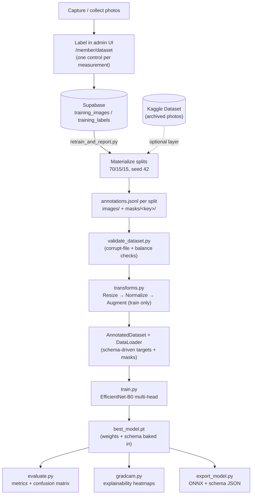

# Model Documentation

This document describes the machine-learning model behind Mantis Vision: the
architecture and why it was chosen, the exact training configuration, the data
pipeline, and how the model is evaluated. All values below are the actual
defaults in [`ml/config.py`](ml/config.py) and the training code — not
illustrative figures.

> **On reported metrics:** the repository ships the *pipeline*, not a trained
> checkpoint or a labeled dataset (images live on Kaggle, checkpoints are
> gitignored). The [Evaluation](#evaluation--metrics) section explains exactly
> what is computed and gives a template to fill in with your own numbers after
> a training run — it deliberately does **not** quote accuracy figures that
> would be fabricated.

## Model at a glance

| Aspect | Value |
|---|---|
| Backbone | EfficientNet-B0, pretrained on ImageNet (transfer learning) |
| Heads | One per measurement in the active schema (classification / regression / segmentation) |
| Input size | 224 × 224 RGB |
| Normalization | ImageNet mean `(0.485, 0.456, 0.406)`, std `(0.229, 0.224, 0.225)` |
| Optimizer | AdamW, weight decay `1e-4` |
| Learning rate | `1e-3` (frozen phase) → `1e-4` (fine-tune phase) |
| Schedule | 2-phase: 10 frozen-backbone epochs, then 20 fine-tune epochs |
| Early stopping | Patience 6 (per phase), min-delta `1e-4`, on validation loss |
| Batch size | 32 |
| Loss | Multi-task weighted sum (cross-entropy / Smooth-L1 / CE+Dice) |
| Regularization | Label smoothing `0.1` (primary head), dropout `0.3` (heads), augmentation |
| Train/val/test split | 70 / 15 / 15 (fixed seed 42) |
| Explainability | Grad-CAM heatmap per prediction |
| Export | ONNX (`opset 18`) + schema JSON for portable/browser/mobile inference |

## Why EfficientNet-B0

EfficientNet-B0 is the smallest model in the EfficientNet family, and it was
chosen deliberately as the first model for this project:

- **Best accuracy-to-size trade-off in its class.** EfficientNet uses *compound
  scaling* (balancing depth, width, and input resolution together) to reach
  ImageNet accuracy comparable to much larger ResNets at a fraction of the
  parameters (~5.3M) and FLOPs.
- **It fits a free/cheap CPU host.** The inference service is designed to run
  on a 512 MB free tier (Render) or a 16 GB free CPU Space (Hugging Face). B0
  is small enough to serve there without a GPU — see the memory notes in the
  [`Dockerfile`](ml/Dockerfile).
- **Transfer learning works well with little data.** Pretrained ImageNet
  features transfer strongly to natural-image domains like seaweed photos, so
  the model learns useful representations from a modest labeled set instead of
  needing tens of thousands of images.
- **Architecture-agnostic training loop.** The backbone is isolated in
  [`ml/src/models/efficientnet.py`](ml/src/models/efficientnet.py); swapping in
  `EfficientNetV2-S`, `ConvNeXt-Tiny`, or `MobileNetV3` later is a one-file
  change — the training loop, losses, and predictor don't care which backbone
  they drive.

### Why this architecture suits seaweed classification

- **Fine-grained, texture-and-colour driven task.** Distinguishing *Healthy*
  from *Disease*/*Decay*/*Dried* seaweed depends on subtle colour shifts,
  bleaching, lesions, and tissue texture. CNNs excel at exactly this kind of
  local texture/colour discrimination, and EfficientNet's multi-scale features
  capture both fine lesions and whole-frond structure.
- **One backbone, many correlated outputs.** Seaweed assessment is naturally
  multi-task: presence, species, health, disease, colour, and lab regressions
  are all read from the *same* image and share visual cues. A shared backbone
  with per-measurement heads lets these tasks reinforce each other while
  keeping the model small — far cheaper than one model per question.
- **Robustness to field-quality photos.** Real specimens are photographed
  underwater or in the field: soft focus, uneven light, sensor noise. The
  augmentation pipeline (below) trains the model to tolerate this instead of
  overfitting to lab-sharp images.
- **Explainability matters for trust.** Grad-CAM overlays let a farmer or
  scientist see *where* the model looked, so a health call can be sanity-checked
  against the actual symptom rather than a background artifact.

## Input size

Images are resized to **224 × 224** (`config.image_size`), the native
resolution EfficientNet-B0 was pretrained at, then normalized with **ImageNet
statistics** (required because the backbone expects inputs distributed like its
pretraining data). The segmentation decoder upsamples back to the input
resolution at forward time, so no fixed output size is baked in.

## Augmentations

Applied **train-only** (validation/test use resize + normalize only). Every
augmentation is chosen to be *biologically safe* — nothing that changes what a
symptom looks like (no vertical flips, no hue inversion, no crops aggressive
enough to remove the diagnostic tissue). From
[`ml/src/data/transforms.py`](ml/src/data/transforms.py):

| Augmentation | Setting | Purpose |
|---|---|---|
| Resize + RandomCrop | resize to 1.15×, crop to 224 | Mild translation/scale invariance |
| RandomHorizontalFlip | p = 0.5 | Left/right symmetry (safe) |
| RandomRotation | ±20° | Camera-angle invariance |
| ColorJitter | brightness 0.25, contrast 0.25, saturation 0.1 | Lighting variation |
| GaussianBlur | p = 0.3, σ ∈ [0.1, 2.0] | Tolerate soft/out-of-focus field photos |
| GaussianNoise | std = 0.03 | Sensor-like noise robustness |

Augmentation, together with label smoothing, is the first-line defense against
real-world quality variation and label noise.

## Dataset & split

- **Format.** Per-image *column annotations* against the active measurement
  schema — an `annotations.jsonl` manifest per split, **not** class folders.
  See [docs/DATASET_LABELING_GUIDE.md](docs/DATASET_LABELING_GUIDE.md).
- **Storage.** Images live in a versioned **Kaggle Dataset**, not in git
  (`ml/scripts/kaggle_sync.py`). The retrain pipeline can also layer in
  admin-labeled photos from Supabase.
- **Dataset size.** The repository does not pin a dataset size — it grows as
  photos are labeled through `/member/dataset`. Record the count used for each
  run in the [Evaluation](#evaluation--metrics) template below;
  `python -m src.data.validate_dataset` prints per-split, per-class counts.
- **Split.** **70% train / 15% validation / 15% test**, applied by the retrain
  pipeline (`ml/scripts/split_dataset.py`) with a **fixed seed (42)** for
  reproducibility.

## Data pipeline



Under the hood the transform stage is:

```
Images → Resize → Normalize (ImageNet stats) → Augmentation (train only) → DataLoader
```

Each `annotations.jsonl` row maps measurement keys to values; a measurement
missing from a row simply contributes no gradient to that head for that image
— which is how optional and conditional measurements (e.g. `disease_severity`
only when `disease != "NoDisease"`) work with no special-casing.

## Training

Two-phase transfer-learning schedule ([`ml/src/train.py`](ml/src/train.py)):

1. **Frozen phase (10 epochs).** The pretrained backbone is frozen; only the
   fresh per-measurement heads train (LR `1e-3`). This stabilizes the randomly
   initialized heads before any pretrained weight is disturbed.
2. **Fine-tune phase (20 epochs).** The backbone is unfrozen and the whole
   network trains end-to-end at a lower LR (`1e-4`).

Both phases use **AdamW** (weight decay `1e-4`) and **early stopping**
(patience 6, min-delta `1e-4`) on validation loss, applied independently per
phase. The best checkpoint (lowest val loss) is saved to
`ml/checkpoints/best_model.pt` **with the schema it was trained against baked
in**, so it is always decoded with its own class order and thresholds — this is
what makes hot-swap promotion safe. Logs go to `ml/logs/train.log`.

```bash
cd ml && python -m src.train
```

## Loss function

The loss is a **schema-driven multi-task weighted sum**
([`ml/src/losses.py`](ml/src/losses.py)) — one term per measurement, each
weighted by that measurement's `loss_weight` and masked to the samples where it
applies and has a labeled value:

| Measurement type | Loss | Notes |
|---|---|---|
| Classification | Cross-entropy | Primary (background-carrying) head gets label smoothing `0.1` |
| Regression | Smooth-L1 | Computed on the value normalized to the measurement's `[min, max]` |
| Segmentation | 0.5 · pixel cross-entropy + 0.5 · soft Dice | Masked to images that have a ground-truth mask |

A term contributes exactly 0 when its batch mask selects no samples, so an
empty mask never produces a NaN — and a newly added measurement with no labeled
data trains safely (its term is 0 until real values arrive).

## Optimizer, learning rate, epochs

- **Optimizer:** AdamW, `weight_decay = 1e-4`.
- **Learning rate:** `1e-3` (frozen phase), `1e-4` (fine-tune phase).
- **Epochs:** up to 10 (frozen) + 20 (fine-tune) = 30, subject to early
  stopping (patience 6 per phase).
- **Batch size:** 32.
- **Seed:** 42 (`config.seed`) — set across Python/NumPy/PyTorch for
  reproducibility.

All of these are single-source-of-truth fields in
[`ml/config.py`](ml/config.py) (`Config` dataclass) and can be changed there
without touching training code.

## Evaluation & metrics

Run on the held-out **test** split:

```bash
cd ml && python -m src.evaluate
```

[`ml/src/evaluate.py`](ml/src/evaluate.py) produces, per measurement:

- **Classification** (primary head, for the confusion matrix): **accuracy**,
  macro/weighted **precision**, **recall**, **F1**, a per-class breakdown, a
  **confusion matrix** image → `ml/reports/confusion_matrix.png`, and one-vs-rest
  **ROC AUC** per class (when the test split has enough samples).
- **Regression:** mean absolute error (MAE) on samples with a ground-truth value.
- **Segmentation:** mean IoU per mask class on samples with a ground-truth mask.
- Full results JSON → `ml/reports/evaluation_results.json`.

### What each metric means

| Metric | Definition | Why it matters here |
|---|---|---|
| Accuracy | Fraction of correct predictions | Overall sanity check — but misleading under class imbalance |
| Precision | TP / (TP + FP) | Of the specimens flagged *Disease*, how many really were |
| Recall | TP / (TP + FN) | Of the truly diseased specimens, how many were caught |
| F1 | Harmonic mean of precision & recall | Balances the two; report macro-F1 for imbalanced classes |
| Confusion matrix | Predicted vs. true class counts | Shows *which* classes get confused (e.g. Decay ↔ Dried) |
| ROC AUC | Ranking quality per class | Threshold-independent separability |

Per the project's "don't rely only on accuracy" requirement, use the **per-class
breakdown and confusion matrix** to decide where to collect more data — e.g. if
`Disease` sits at 81% recall while `Dried` is at 99%, collect more `Disease`
photos rather than tuning hyperparameters.

### Results template (fill in after a run)

Replace this with the real output of `python -m src.evaluate` for your dataset.
Do not ship placeholder numbers as if they were measured.

| Class | Precision | Recall | F1 | Support |
|---|---|---|---|---|
| Healthy | — | — | — | — |
| Moderate | — | — | — | — |
| Low | — | — | — | — |
| **macro avg** | — | — | — | — |
| **weighted avg** | — | — | — | — |

- Accuracy: —
- Dataset size (train/val/test): — / — / —
- Confusion matrix: `ml/reports/confusion_matrix.png`

## Explainability (Grad-CAM)

```bash
cd ml && python -m src.gradcam path/to/photo.jpg   # → photo.gradcam.png
```

Grad-CAM targets the primary classification head's final conv layer and
produces a heatmap of the regions that most influenced the prediction. It is
also wired into the inference API, so every `/predict` response can include its
heatmap (`gradcam_png_base64`), not just a bare label. Inspect **both correct
and incorrect** predictions — a misclassification with a highlighted background
artifact tells you the model is shortcutting.

## Checkpoint format & export

- **Checkpoint** (`best_model.pt`): a dict with `model_state_dict`, the full
  `schema` (so it is self-describing), plus `val_loss`/`epoch`. Older
  pre-schema checkpoints are still loadable via a synthesized schema
  (`legacy_schema_from_checkpoint`).
- **ONNX export** (`python scripts/export_model.py`): writes
  `seaweed_multihead.onnx` (opset 18, dynamic batch axis, one output tensor per
  measurement in schema order) and `class_names.json` (the full schema, so a
  browser/mobile consumer can interpret each output tensor). From ONNX you can
  convert further to TensorFlow Lite or CoreML for native mobile builds.

## Serving

The model is served by a FastAPI app that loads the checkpoint (and its schema)
and returns a structured per-measurement report plus the Grad-CAM overlay. See
[API.md](API.md) for the endpoints and [ARCHITECTURE.md](ARCHITECTURE.md) for
how promotion hot-swaps a new checkpoint with zero downtime.
